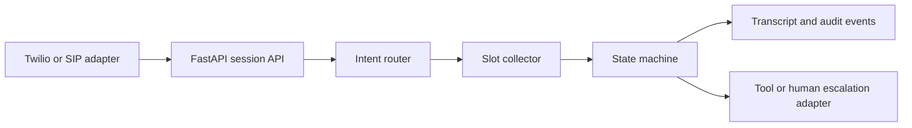

# Voice Agent Orchestrator

[](https://github.com/ashfakmohamed/voice-agent-orchestrator/actions/workflows/ci.yml)

A deterministic orchestration core for enterprise voice-agent sessions. It models call lifecycle, intent routing, slot collection, escalation, transcripts, and auditable state transitions without requiring telephony or LLM credentials.

## Capabilities

- inbound and outbound session creation
- appointment, billing, support, escalation, and goodbye intents
- appointment-date and account-reference slot extraction
- explicit session state machine
- immutable API responses and per-session isolation
- audit events for escalation and completion
- synthetic test data only

## Architecture



The adapters are deliberately separated from orchestration logic. A production integration can replace the deterministic router with an LLM classifier and connect LiveKit or Twilio without changing session-state rules.

## Run locally

```bash
python -m venv .venv
.venv\\Scripts\\activate
pip install -r requirements-dev.txt
uvicorn app.main:app --reload
```

Open `http://127.0.0.1:8000/docs` for the interactive API.

## Example flow

```bash
curl -X POST http://127.0.0.1:8000/sessions \
  -H "Content-Type: application/json" \
  -d '{"caller_id":"+15550001111","direction":"inbound"}'

curl -X POST http://127.0.0.1:8000/sessions/SESSION_ID/messages \
  -H "Content-Type: application/json" \
  -d '{"text":"Schedule an appointment for 2026-11-15"}'
```

## Session states

| State | Meaning |
| --- | --- |
| `greeting` | Session created and assistant greeting emitted |
| `collecting_details` | More intent or slot information is required |
| `resolving` | Request has enough information for a tool or workflow |
| `escalated` | Caller requested a human agent |
| `completed` | Conversation ended |

## Quality checks

```bash
ruff check .
python -m pytest -q
```

## Production extensions

- persist sessions and events in PostgreSQL
- publish events through Redis or Kafka
- connect LiveKit and Twilio adapters
- replace keyword routing with structured LLM classification
- add authentication, rate limits, and tenant isolation
- export call metrics and traces to an observability platform
